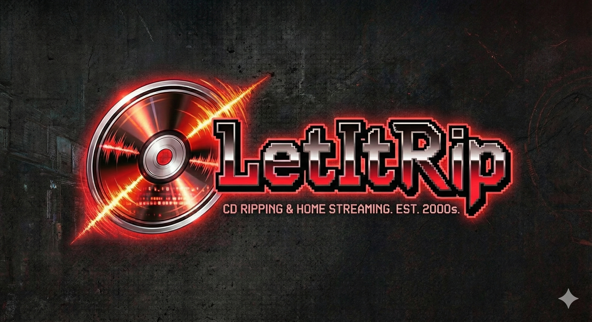

# letitrip

Let it rip—turn your CDs into a personal Spotify powered by a Raspberry Pi.

## Overview

letitrip is a two-part system for ripping CD collections to lossless audio and streaming them on a home network.

- **Ripper (Windows CLI)**: Detects discs, fetches MusicBrainz metadata + cover art, and rips to FLAC.
- **Server (Raspberry Pi)**: Runs Navidrome in Docker for streaming to web, mobile, and Bluesound.

## Quick Start

### Windows Ripper

**Quick Install (Recommended):**

```powershell
# One-line installer
irm https://raw.githubusercontent.com/cloudboy-jh/letitrip/main/install.ps1 | iex
```

This will:
- Download the latest `letitrip.exe` 
- Install FLAC tools (if not already installed)
- Add to your PATH

**Manual Install:**

1. Download the latest `letitrip_windows_amd64.zip` from [Releases](https://github.com/cloudboy-jh/letitrip/releases)
2. Extract `letitrip.exe` to a folder (e.g., `C:\Program Files\letitrip\`)
3. Add that folder to your PATH
4. Install FLAC tools: `winget install Xiph.FLAC`

**Build from Source (for developers):**

```powershell
git clone https://github.com/cloudboy-jh/letitrip.git
cd letitrip\letitrip
go build -o letitrip.exe .
```

**Requirements:**

- FLAC tools (flac.exe + metaflac.exe) - installed via winget or from [https://xiph.org/flac/download.html](https://xiph.org/flac/download.html)

**Note:** The Windows version uses native Windows CD-ROM APIs for disc reading and ripping - no external CD ripping tools needed!

### Raspberry Pi Server

```bash
curl -fsSL https://raw.githubusercontent.com/cloudboy-jh/letitrip/main/server/setup.sh | bash
sudo mount /dev/sda1 /mnt/music
cd /opt/letitrip && docker compose up -d
```

## Usage

```bash
letitrip
letitrip --output D:/Music
letitrip --info
letitrip --yes
letitrip config --output D:/Music
```

## Output Structure

```
Music/
└── Artist/
    └── Album/
        ├── cover.jpg
        ├── 01 - Track.flac
        └── ...
```

## Repository Layout

```
letitrip/             # Go CLI
server/               # Navidrome setup
SPEC.md               # Full spec
```

## License

MIT. See `LICENSE`.
